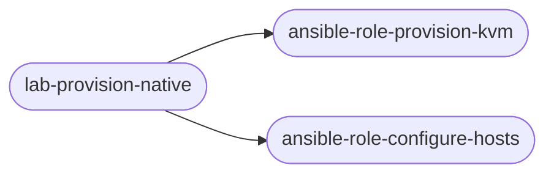
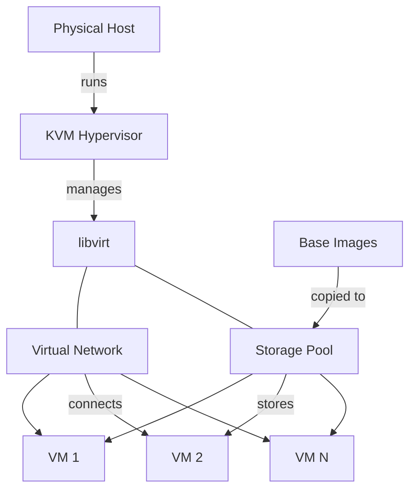
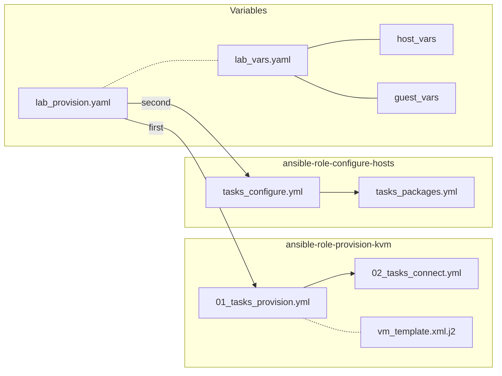
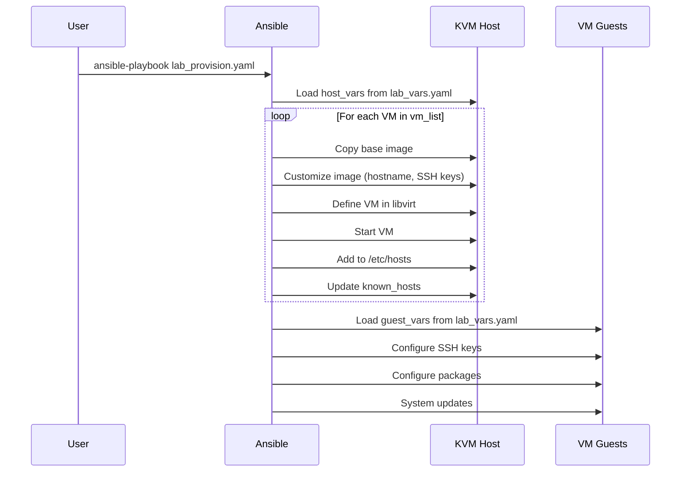

# Lab Provision - Native Libvirt


<!-- @import "[TOC]" {cmd="toc" depthFrom=2 depthTo=6 orderedList=false} -->

<!-- code_chunk_output -->

- [Description](#description)
- [🏗️ Architecture](#️-architecture)
  - [🖥️ Infrastructure](#️-infrastructure)
  - [🧩 Role Structure](#-role-structure)
  - [🔄 Execution Flow](#-execution-flow)
- [🚀 Quick Setup](#-quick-setup)
- [📦 Roles](#-roles)
  - [ansible-role-provision-kvm](#ansible-role-provision-kvm)
  - [ansible-role-configure-hosts](#ansible-role-configure-hosts)
- [📋 Prerequisites](#-prerequisites)

<!-- /code_chunk_output -->

---

## Description

**lab-provision-native** is an Ansible project that provisions and configures virtual machines on RHEL-like hosts using the KVM hypervisor.

**Credits:**
This project is heavily inspired from the [Build a lab in 36 seconds with Ansible](https://www.redhat.com/sysadmin/build-VM-fast-ansible) article by _Ricardo Gerardi_ which itself is based on the [Build a lab in five minutes with three simple commands](https://www.redhat.com/sysadmin/build-lab-quickly) article from _Alex Callejas_;
Reading these articles is recommended to see the evolution of the concept.



---

## 🏗️ Architecture

### 🖥️ Infrastructure

Libvirt high-level architecture



### 🧩 Role Structure

This project's features are divided into two main parts, represented by 2 Ansible roles:

- **ansible-role-provision-kvm:** VM provisioning
- **ansible-role-configure-hosts:** Post-provisioning configuration



### 🔄 Execution Flow



---

## 🚀 Quick Setup

1. **Clone the repository:**

   ```bash
   git clone https://github.com/chouaieb-sleimi/lab-provision-native.git
   cd lab-provision-native
   ```

2. **Install the roles:**

   ```bash
   ansible-galaxy role install -r roles/requirements.yaml -p roles/
   ```

3. **Configure variables:** Edit `lab_vars.yaml` with your VM specifications

4. **Configure inventory:**

   ```ini
   [vm_hosts]
   localhost ansible_connection=local
   ```

5. **Launch the playbook:**

   ```bash
   ansible-playbook -i inventory/inventory --ask-become-pass lab_provision.yaml
   ```

---

## 📦 Roles

### ansible-role-provision-kvm

Provisions guest VMs defined in `vm_list` and ensures basic connectivity.
Role repository: [chouaieb-sleimi/ansible-role-provision-kvm-native](https://github.com/chouaieb-sleimi/ansible-role-provision-kvm-native)

**Features:**

- Provision VM guests using libvirt
- Add VM hostnames to host's `/etc/hosts` file
- Update `known_hosts` file (avoids SSH fingerprint errors)

**Variables:** See `lab_vars.yaml` for all configuration options

### ansible-role-configure-hosts

Performs post-provisioning configuration on VM guests. Most steps can be disabled via boolean variables.
Role repository: [chouaieb-sleimi/ansible-role-configure-hosts](https://github.com/chouaieb-sleimi/ansible-role-configure-hosts)

**Features:**

- **Basic configuration:** SSH keys, keyboard layout, hosts file, aliases
- **Package management:** DNF configuration, RHEL subscriptions, package installation, system updates

**Variables:** See `lab_vars.yaml` for all configuration options

---

## 📋 Prerequisites

- **KVM/QEMU** installed and running
- **libvirt** service active
- Base VM images in **QCOW2 format**
- **Ansible** with required collections
